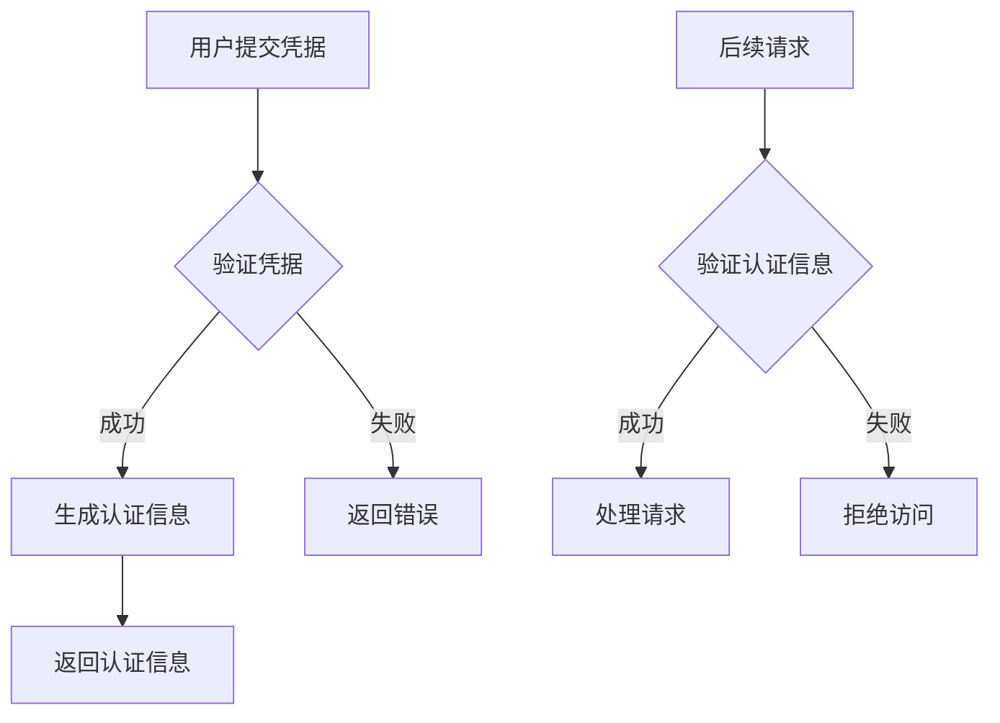

## 认证基础概念

### 认证流程



### 基本认证模型

```javascript
// models/User.js
const mongoose = require('mongoose');
const bcrypt = require('bcryptjs');

const userSchema = new mongoose.Schema({
  username: {
    type: String,
    required: true,
    unique: true,
    trim: true
  },
  email: {
    type: String,
    required: true,
    unique: true,
    lowercase: true
  },
  password: {
    type: String,
    required: true,
    minlength: 6
  },
  role: {
    type: String,
    enum: ['user', 'admin'],
    default: 'user'
  }
});

// 密码加密中间件
userSchema.pre('save', async function(next) {
  if (!this.isModified('password')) return next();
  this.password = await bcrypt.hash(this.password, 10);
  next();
});

// 密码验证方法
userSchema.methods.comparePassword = async function(candidatePassword) {
  return await bcrypt.compare(candidatePassword, this.password);
};

module.exports = mongoose.model('User', userSchema);
```

## Session-Based 认证

### 配置 Session

```javascript
// config/session.js
const session = require('express-session');
const MongoStore = require('connect-mongo');

module.exports = session({
  secret: process.env.SESSION_SECRET,
  resave: false,
  saveUninitialized: false,
  store: MongoStore.create({
    mongoUrl: process.env.MONGODB_URI
  }),
  cookie: {
    secure: process.env.NODE_ENV === 'production',
    maxAge: 24 * 60 * 60 * 1000 // 24小时
  }
});
```

### 实现登录

```javascript
// routes/auth.js
const express = require('express');
const router = express.Router();
const User = require('../models/User');

router.post('/login', async (req, res) => {
  try {
    const { username, password } = req.body;
    
    // 查找用户
    const user = await User.findOne({ username });
    if (!user) {
      return res.status(401).json({ error: 'Invalid credentials' });
    }
    
    // 验证密码
    const isMatch = await user.comparePassword(password);
    if (!isMatch) {
      return res.status(401).json({ error: 'Invalid credentials' });
    }
    
    // 创建会话
    req.session.user = {
      id: user._id,
      username: user.username,
      role: user.role
    };
    
    res.json({ message: 'Logged in successfully' });
  } catch (error) {
    res.status(500).json({ error: error.message });
  }
});

// 登出
router.post('/logout', (req, res) => {
  req.session.destroy((err) => {
    if (err) {
      return res.status(500).json({ error: 'Could not log out' });
    }
    res.clearCookie('connect.sid');
    res.json({ message: 'Logged out successfully' });
  });
});
```

### 认证中间件

```javascript
// middleware/auth.js
const authenticate = (req, res, next) => {
  if (!req.session.user) {
    return res.status(401).json({ error: 'Unauthorized' });
  }
  req.user = req.session.user;
  next();
};

module.exports = { authenticate };
```

## JWT 认证

### JWT 配置

```javascript
// config/jwt.js
const jwt = require('jsonwebtoken');

module.exports = {
  secret: process.env.JWT_SECRET,
  expiresIn: '24h',
  refreshSecret: process.env.JWT_REFRESH_SECRET,
  refreshExpiresIn: '7d'
};
```

### 生成和验证令牌

```javascript
// services/tokenService.js
const jwt = require('../config/jwt');

class TokenService {
  static generateAccessToken(user) {
    return jwt.sign(
      { id: user._id, username: user.username, role: user.role },
      jwt.secret,
      { expiresIn: jwt.expiresIn }
    );
  }

  static generateRefreshToken(user) {
    return jwt.sign(
      { id: user._id },
      jwt.refreshSecret,
      { expiresIn: jwt.refreshExpiresIn }
    );
  }

  static verifyAccessToken(token) {
    return jwt.verify(token, jwt.secret);
  }

  static verifyRefreshToken(token) {
    return jwt.verify(token, jwt.refreshSecret);
  }
}

module.exports = TokenService;
```

### 实现 JWT 认证

```javascript
// routes/auth.js
const TokenService = require('../services/tokenService');

router.post('/login', async (req, res) => {
  try {
    const { username, password } = req.body;
    
    const user = await User.findOne({ username });
    if (!user || !await user.comparePassword(password)) {
      return res.status(401).json({ error: 'Invalid credentials' });
    }
    
    const accessToken = TokenService.generateAccessToken(user);
    const refreshToken = TokenService.generateRefreshToken(user);
    
    res.json({
      accessToken,
      refreshToken
    });
  } catch (error) {
    res.status(500).json({ error: error.message });
  }
});

// 令牌刷新
router.post('/refresh', async (req, res) => {
  try {
    const { refreshToken } = req.body;
    
    const decoded = TokenService.verifyRefreshToken(refreshToken);
    const user = await User.findById(decoded.id);
    
    if (!user) {
      return res.status(401).json({ error: 'Invalid refresh token' });
    }
    
    const newAccessToken = TokenService.generateAccessToken(user);
    res.json({ accessToken: newAccessToken });
  } catch (error) {
    res.status(403).json({ error: 'Invalid refresh token' });
  }
});
```

### JWT 认证中间件

```javascript
// middleware/auth.js
const TokenService = require('../services/tokenService');

const authenticateToken = (req, res, next) => {
  const authHeader = req.headers['authorization'];
  const token = authHeader && authHeader.split(' ')[1];
  
  if (!token) {
    return res.status(401).json({ error: 'Access token required' });
  }
  
  try {
    const decoded = TokenService.verifyAccessToken(token);
    req.user = decoded;
    next();
  } catch (error) {
    res.status(403).json({ error: 'Invalid token' });
  }
};

module.exports = { authenticateToken };
```

## OAuth 认证

### 配置 Passport

```javascript
// config/passport.js
const passport = require('passport');
const GoogleStrategy = require('passport-google-oauth20').Strategy;

passport.use(new GoogleStrategy({
  clientID: process.env.GOOGLE_CLIENT_ID,
  clientSecret: process.env.GOOGLE_CLIENT_SECRET,
  callbackURL: "/auth/google/callback"
},
async (accessToken, refreshToken, profile, done) => {
  try {
    let user = await User.findOne({ googleId: profile.id });
    
    if (user) {
      return done(null, user);
    }
    
    user = new User({
      googleId: profile.id,
      username: profile.displayName,
      email: profile.emails[0].value
    });
    
    await user.save();
    done(null, user);
  } catch (error) {
    done(error, null);
  }
}
));
```

### OAuth 路由

```javascript
// routes/auth.js
const passport = require('passport');

// Google OAuth
router.get('/google',
  passport.authenticate('google', { scope: ['profile', 'email'] })
);

router.get('/google/callback',
  passport.authenticate('google', { session: false }),
  (req, res) => {
    const token = TokenService.generateAccessToken(req.user);
    res.json({ token });
  }
);
```

## 密码安全

### 密码策略

```javascript
// utils/passwordValidator.js
const passwordValidator = require('password-validator');

const schema = new passwordValidator();

schema
  .is().min(8)
  .has().uppercase()
  .has().lowercase()
  .has().digits()
  .has().not().spaces();

const validatePassword = (password) => {
  const errors = [];
  if (!schema.validate(password)) {
    errors.push(...schema.validate(password, { list: true }));
  }
  return errors;
};

module.exports = { validatePassword };
```

### 密码重置

```javascript
// routes/auth.js
const crypto = require('crypto');
const nodemailer = require('nodemailer');

// 请求密码重置
router.post('/forgot-password', async (req, res) => {
  try {
    const { email } = req.body;
    const user = await User.findOne({ email });
    
    if (!user) {
      return res.status(404).json({ error: 'User not found' });
    }
    
    // 生成重置令牌
    const resetToken = crypto.randomBytes(20).toString('hex');
    user.resetPasswordToken = resetToken;
    user.resetPasswordExpires = Date.now() + 3600000; // 1小时
    await user.save();
    
    // 发送邮件
    const transporter = nodemailer.createTransport({
      service: 'gmail',
      auth: {
        user: process.env.EMAIL_USER,
        pass: process.env.EMAIL_PASS
      }
    });
    
    const mailOptions = {
      from: process.env.EMAIL_USER,
      to: user.email,
      subject: 'Password Reset',
      text: `You are receiving this because you requested a password reset. 
              Please click: http://${req.headers.host}/reset-password/${resetToken}`
    };
    
    await transporter.sendMail(mailOptions);
    res.json({ message: 'Password reset email sent' });
  } catch (error) {
    res.status(500).json({ error: error.message });
  }
});

// 重置密码
router.post('/reset-password/:token', async (req, res) => {
  try {
    const user = await User.findOne({
      resetPasswordToken: req.params.token,
      resetPasswordExpires: { $gt: Date.now() }
    });
    
    if (!user) {
      return res.status(400).json({ error: 'Invalid or expired reset token' });
    }
    
    user.password = req.body.password;
    user.resetPasswordToken = undefined;
    user.resetPasswordExpires = undefined;
    await user.save();
    
    res.json({ message: 'Password reset successful' });
  } catch (error) {
    res.status(500).json({ error: error.message });
  }
});
```

## 安全最佳实践

### 1. 安全头部

```javascript
// middleware/security.js
const helmet = require('helmet');

module.exports = helmet({
  contentSecurityPolicy: {
    directives: {
      defaultSrc: ["'self'"],
      styleSrc: ["'self'", "'unsafe-inline'"],
      scriptSrc: ["'self'"],
      imgSrc: ["'self'", "data:", "https:"]
    }
  },
  hsts: {
    maxAge: 31536000,
    includeSubDomains: true,
    preload: true
  }
});
```

### 2. 速率限制

```javascript
// middleware/rateLimit.js
const rateLimit = require('express-rate-limit');

const loginLimiter = rateLimit({
  windowMs: 15 * 60 * 1000, // 15分钟
  max: 5, // 限制每个IP 5次尝试
  message: 'Too many login attempts, please try again later',
  standardHeaders: true,
  legacyHeaders: false
});

module.exports = { loginLimiter };
```

### 3. 输入验证

```javascript
// middleware/validation.js
const { body, validationResult } = require('express-validator');

const validateLogin = [
  body('username')
    .trim()
    .notEmpty()
    .withMessage('Username is required'),
  body('password')
    .isLength({ min: 6 })
    .withMessage('Password must be at least 6 characters long'),
  
  (req, res, next) => {
    const errors = validationResult(req);
    if (!errors.isEmpty()) {
      return res.status(400).json({ errors: errors.array() });
    }
    next();
  }
];

module.exports = { validateLogin };
```

## 总结

Express 认证系统的关键点：

1. **认证方式选择**
   - Session-Based：传统Web应用
   - JWT：API和微服务
   - OAuth：第三方登录

2. **安全措施**
   - 密码加密存储
   - 令牌安全管理
   - 速率限制
   - 输入验证

3. **最佳实践**
   - 使用HTTPS
   - 实现密码重置
   - 设置安全头部
   - 定期更新密钥

4. **错误处理**
   - 统一错误响应
   - 安全的错误信息
   - 日志记录

通过实现这些机制，可以构建一个安全、可靠的认证系统。记住，安全是一个持续的过程，需要不断更新和改进安全措施。