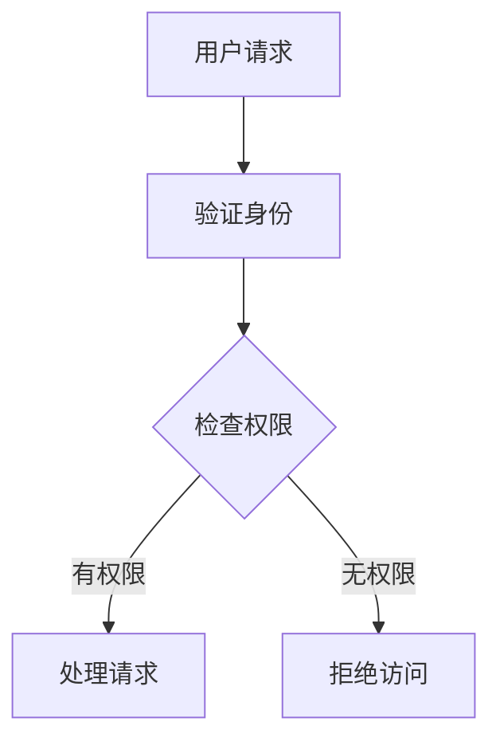

## 授权基础概念

### 授权流程



### 基本授权模型

```javascript
// models/Permission.js
const mongoose = require('mongoose');

const permissionSchema = new mongoose.Schema({
  name: {
    type: String,
    required: true,
    unique: true
  },
  description: String,
  resource: {
    type: String,
    required: true
  },
  action: {
    type: String,
    required: true,
    enum: ['create', 'read', 'update', 'delete', 'manage']
  }
});

module.exports = mongoose.model('Permission', permissionSchema);
```

## 基于角色的访问控制(RBAC)

### 角色模型

```javascript
// models/Role.js
const mongoose = require('mongoose');

const roleSchema = new mongoose.Schema({
  name: {
    type: String,
    required: true,
    unique: true
  },
  description: String,
  permissions: [{
    type: mongoose.Schema.Types.ObjectId,
    ref: 'Permission'
  }],
  hierarchy: {
    type: Number,
    default: 0
  }
});

module.exports = mongoose.model('Role', roleSchema);
```

### 用户角色关联

```javascript
// models/User.js
const userSchema = new mongoose.Schema({
  username: String,
  email: String,
  roles: [{
    type: mongoose.Schema.Types.ObjectId,
    ref: 'Role'
  }]
});

// 添加角色检查方法
userSchema.methods.hasRole = function(roleName) {
  return this.roles.some(role => role.name === roleName);
};

userSchema.methods.hasPermission = function(permission) {
  return this.roles.some(role => 
    role.permissions.includes(permission)
  );
};
```

### RBAC 中间件

```javascript
// middleware/rbac.js
const Role = require('../models/Role');
const Permission = require('../models/Permission');

const checkRole = (...roles) => {
  return async (req, res, next) => {
    try {
      const user = await User.findById(req.user.id).populate('roles');
      
      if (!user) {
        return res.status(401).json({ error: 'User not found' });
      }
      
      const hasRole = roles.some(role => 
        user.roles.some(userRole => userRole.name === role)
      );
      
      if (!hasRole) {
        return res.status(403).json({ error: 'Insufficient permissions' });
      }
      
      next();
    } catch (error) {
      res.status(500).json({ error: error.message });
    }
  };
};

const checkPermission = (resource, action) => {
  return async (req, res, next) => {
    try {
      const user = await User.findById(req.user.id).populate({
        path: 'roles',
        populate: {
          path: 'permissions'
        }
      });
      
      const hasPermission = user.roles.some(role =>
        role.permissions.some(permission =>
          permission.resource === resource &&
          permission.action === action
        )
      );
      
      if (!hasPermission) {
        return res.status(403).json({ error: 'Insufficient permissions' });
      }
      
      next();
    } catch (error) {
      res.status(500).json({ error: error.message });
    }
  };
};

module.exports = { checkRole, checkPermission };
```

### 使用示例

```javascript
// routes/admin.js
const express = require('express');
const router = express.Router();
const { checkRole, checkPermission } = require('../middleware/rbac');

// 只有管理员可以访问
router.get('/users', 
  checkRole('admin'),
  async (req, res) => {
    const users = await User.find();
    res.json(users);
  }
);

// 需要特定权限
router.post('/posts',
  checkPermission('posts', 'create'),
  async (req, res) => {
    // 创建文章逻辑
  }
);
```

## 基于属性的访问控制(ABAC)

### 属性模型

```javascript
// models/Policy.js
const mongoose = require('mongoose');

const policySchema = new mongoose.Schema({
  name: String,
  rules: [{
    attribute: String,
    operator: {
      type: String,
      enum: ['equals', 'contains', 'greater', 'less', 'in']
    },
    value: mongoose.Schema.Types.Mixed
  }],
  effect: {
    type: String,
    enum: ['allow', 'deny'],
    default: 'allow'
  }
});

module.exports = mongoose.model('Policy', policySchema);
```

### ABAC 实现

```javascript
// services/abacService.js
class ABACService {
  static async evaluatePolicy(user, resource, action) {
    const policies = await Policy.find();
    
    for (const policy of policies) {
      const result = await this.evaluateRules(policy.rules, {
        user,
        resource,
        action
      });
      
      if (result) {
        return policy.effect === 'allow';
      }
    }
    
    return false; // 默认拒绝
  }
  
  static async evaluateRules(rules, context) {
    return rules.every(rule => {
      const { attribute, operator, value } = rule;
      const contextValue = this.getAttributeValue(attribute, context);
      
      switch (operator) {
        case 'equals':
          return contextValue === value;
        case 'contains':
          return contextValue.includes(value);
        case 'greater':
          return contextValue > value;
        case 'less':
          return contextValue < value;
        case 'in':
          return value.includes(contextValue);
        default:
          return false;
      }
    });
  }
  
  static getAttributeValue(attribute, context) {
    const parts = attribute.split('.');
    let value = context;
    
    for (const part of parts) {
      value = value[part];
    }
    
    return value;
  }
}

module.exports = ABACService;
```

### ABAC 中间件

```javascript
// middleware/abac.js
const ABACService = require('../services/abacService');

const checkABAC = (resource, action) => {
  return async (req, res, next) => {
    try {
      const user = await User.findById(req.user.id);
      const isAllowed = await ABACService.evaluatePolicy(
        user,
        resource,
        action
      );
      
      if (!isAllowed) {
        return res.status(403).json({ error: 'Access denied' });
      }
      
      next();
    } catch (error) {
      res.status(500).json({ error: error.message });
    }
  };
};

module.exports = { checkABAC };
```

## 资源所有权控制

### 所有权中间件

```javascript
// middleware/ownership.js
const checkOwnership = (resourceModel) => {
  return async (req, res, next) => {
    try {
      const resource = await resourceModel.findById(req.params.id);
      
      if (!resource) {
        return res.status(404).json({ error: 'Resource not found' });
      }
      
      // 检查是否是资源所有者或管理员
      const isOwner = resource.owner.toString() === req.user.id;
      const isAdmin = req.user.roles.includes('admin');
      
      if (!isOwner && !isAdmin) {
        return res.status(403).json({ error: 'Access denied' });
      }
      
      req.resource = resource;
      next();
    } catch (error) {
      res.status(500).json({ error: error.message });
    }
  };
};

module.exports = { checkOwnership };
```

### 使用示例

```javascript
// routes/posts.js
const { checkOwnership } = require('../middleware/ownership');

router.put('/posts/:id',
  authenticateToken,
  checkOwnership(Post),
  async (req, res) => {
    // 更新文章逻辑
  }
);
```

## 权限中间件实现

### 组合中间件

```javascript
// middleware/permissions.js
const combine = (...middlewares) => {
  return async (req, res, next) => {
    for (const middleware of middlewares) {
      await new Promise((resolve, reject) => {
        middleware(req, res, (err) => {
          if (err) return reject(err);
          resolve();
        });
      });
    }
    next();
  };
};

// 使用示例
router.post('/posts',
  combine(
    authenticateToken,
    checkRole('author'),
    checkPermission('posts', 'create')
  ),
  createPost
);
```

### 权限缓存

```javascript
// services/permissionCache.js
const NodeCache = require('node-cache');
const cache = new NodeCache({ stdTTL: 300 }); // 5分钟缓存

class PermissionCache {
  static async getPermissions(userId) {
    const cacheKey = `permissions:${userId}`;
    let permissions = cache.get(cacheKey);
    
    if (!permissions) {
      const user = await User.findById(userId).populate({
        path: 'roles',
        populate: {
          path: 'permissions'
        }
      });
      
      permissions = user.roles.reduce((acc, role) => {
        return acc.concat(role.permissions);
      }, []);
      
      cache.set(cacheKey, permissions);
    }
    
    return permissions;
  }
  
  static clearUserPermissions(userId) {
    cache.del(`permissions:${userId}`);
  }
}

module.exports = PermissionCache;
```

## 动态权限管理

### 权限管理API

```javascript
// routes/permissions.js
router.post('/roles/:roleId/permissions',
  checkRole('admin'),
  async (req, res) => {
    try {
      const role = await Role.findById(req.params.roleId);
      if (!role) {
        return res.status(404).json({ error: 'Role not found' });
      }
      
      const permission = await Permission.findById(req.body.permissionId);
      if (!permission) {
        return res.status(404).json({ error: 'Permission not found' });
      }
      
      role.permissions.push(permission);
      await role.save();
      
      // 清除相关用户的权限缓存
      await clearRoleUsersCache(role._id);
      
      res.json({ message: 'Permission added to role' });
    } catch (error) {
      res.status(500).json({ error: error.message });
    }
  }
);

async function clearRoleUsersCache(roleId) {
  const users = await User.find({ roles: roleId });
  users.forEach(user => {
    PermissionCache.clearUserPermissions(user._id);
  });
}
```

### 权限检查服务

```javascript
// services/permissionService.js
class PermissionService {
  static async checkPermission(userId, resource, action) {
    const permissions = await PermissionCache.getPermissions(userId);
    
    return permissions.some(permission =>
      permission.resource === resource &&
      permission.action === action
    );
  }
  
  static async checkRole(userId, roleName) {
    const user = await User.findById(userId).populate('roles');
    return user.roles.some(role => role.name === roleName);
  }
}

module.exports = PermissionService;
```

## 安全最佳实践

### 1. 权限最小化原则

```javascript
// 默认拒绝策略
const defaultDeny = (req, res, next) => {
  res.status(403).json({ error: 'Access denied by default' });
};

// 明确允许的权限
router.get('/sensitive-data',
  combine(
    authenticateToken,
    checkRole('admin'),
    checkPermission('sensitive', 'read')
  ),
  getData,
  defaultDeny // 默认拒绝
);
```

### 2. 权限审计

```javascript
// middleware/audit.js
const auditLog = (req, res, next) => {
  const originalSend = res.send;
  
  res.send = function(data) {
    // 记录权限检查日志
    console.log({
      user: req.user.id,
      resource: req.path,
      action: req.method,
      status: res.statusCode,
      timestamp: new Date()
    });
    
    originalSend.call(this, data);
  };
  
  next();
};
```

### 3. 权限测试

```javascript
// tests/permissions.test.js
describe('Permission Tests', () => {
  test('Admin should access all resources', async () => {
    const adminToken = await getAdminToken();
    const response = await request(app)
      .get('/admin/users')
      .set('Authorization', `Bearer ${adminToken}`);
    
    expect(response.status).toBe(200);
  });
  
  test('User should not access admin resources', async () => {
    const userToken = await getUserToken();
    const response = await request(app)
      .get('/admin/users')
      .set('Authorization', `Bearer ${userToken}`);
    
    expect(response.status).toBe(403);
  });
});
```

## 总结

Express 授权系统的关键点：

1. **授权策略选择**
   - RBAC：基于角色的访问控制
   - ABAC：基于属性的访问控制
   - 混合模式：结合多种策略

2. **实现要点**
   - 权限中间件设计
   - 资源所有权控制
   - 动态权限管理

3. **安全考虑**
   - 最小权限原则
   - 权限审计
   - 默认拒绝策略

4. **性能优化**
   - 权限缓存
   - 批量权限检查
   - 权限预加载

通过合理实现这些机制，可以构建一个灵活、安全的授权系统。记住，授权系统需要根据具体业务需求进行设计和调整，同时要注重安全性和可维护性。