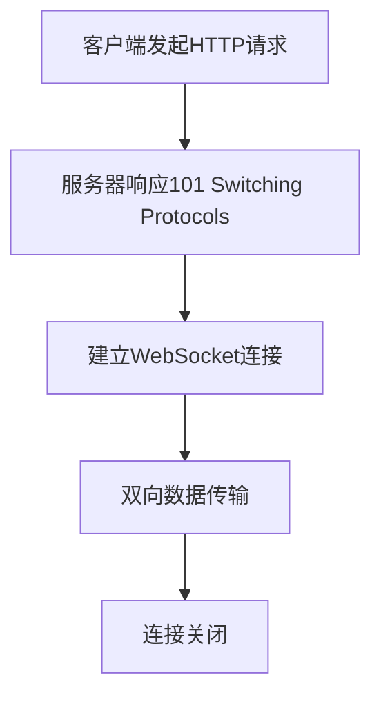

## WebSocket 基础

### WebSocket 与 HTTP 的区别

| 特性 | HTTP | WebSocket |
|------|------|-----------|
| 连接方式 | 请求-响应 | 持久连接 |
| 协议 | HTTP/HTTPS | WS/WSS |
| 状态 | 无状态 | 有状态 |
| 通信方向 | 单向 | 双向 |
| 适用场景 | 常规请求 | 实时通信 |

### 基本连接流程



## Express 中集成 WebSocket

### 安装依赖

```bash
npm install ws
npm install socket.io # 或使用 Socket.IO
```

### 基本 WebSocket 服务器

```javascript
// server.js
const express = require('express');
const http = require('http');
const WebSocket = require('ws');

const app = express();
const server = http.createServer(app);
const wss = new WebSocket.Server({ server });

// WebSocket 连接处理
wss.on('connection', (ws) => {
  console.log('New client connected');
  
  // 消息处理
  ws.on('message', (message) => {
    console.log('Received:', message);
    
    // 广播消息
    wss.clients.forEach((client) => {
      if (client !== ws && client.readyState === WebSocket.OPEN) {
        client.send(message);
      }
    });
  });
  
  // 连接关闭
  ws.on('close', () => {
    console.log('Client disconnected');
  });
});

const PORT = process.env.PORT || 3000;
server.listen(PORT, () => {
  console.log(`Server running on port ${PORT}`);
});
```

### Socket.IO 集成

```javascript
// server.js
const express = require('express');
const http = require('http');
const { Server } = require('socket.io');

const app = express();
const server = http.createServer(app);
const io = new Server(server, {
  cors: {
    origin: "*",
    methods: ["GET", "POST"]
  }
});

// Socket.IO 连接处理
io.on('connection', (socket) => {
  console.log('User connected:', socket.id);
  
  // 加入房间
  socket.on('join-room', (roomId) => {
    socket.join(roomId);
    socket.to(roomId).emit('user-joined', socket.id);
  });
  
  // 发送消息
  socket.on('send-message', (data) => {
    const { roomId, message } = data;
    io.to(roomId).emit('receive-message', {
      message,
      senderId: socket.id
    });
  });
  
  // 断开连接
  socket.on('disconnect', () => {
    console.log('User disconnected:', socket.id);
  });
});

server.listen(3000, () => {
  console.log('Server running on port 3000');
});
```

## 实时通信实现

### 聊天应用示例

```javascript
// services/chatService.js
class ChatService {
  constructor(io) {
    this.io = io;
    this.rooms = new Map();
  }
  
  createRoom(roomId) {
    if (!this.rooms.has(roomId)) {
      this.rooms.set(roomId, {
        users: new Set(),
        messages: []
      });
    }
    return this.rooms.get(roomId);
  }
  
  joinRoom(socket, roomId, username) {
    const room = this.createRoom(roomId);
    room.users.add({ socketId: socket.id, username });
    
    socket.join(roomId);
    
    // 通知房间内其他用户
    socket.to(roomId).emit('user-joined', {
      username,
      users: Array.from(room.users)
    });
    
    // 发送房间历史消息
    socket.emit('room-history', room.messages);
  }
  
  sendMessage(socket, roomId, message) {
    const room = this.rooms.get(roomId);
    if (!room) return;
    
    const messageData = {
      id: Date.now(),
      username: socket.username,
      message,
      timestamp: new Date()
    };
    
    room.messages.push(messageData);
    
    // 广播消息到房间
    this.io.to(roomId).emit('new-message', messageData);
  }
}

module.exports = ChatService;
```

### 实时通知系统

```javascript
// services/notificationService.js
class NotificationService {
  constructor(io) {
    this.io = io;
    this.userSockets = new Map();
  }
  
  registerUser(userId, socket) {
    this.userSockets.set(userId, socket);
  }
  
  unregisterUser(userId) {
    this.userSockets.delete(userId);
  }
  
  sendNotification(userId, notification) {
    const socket = this.userSockets.get(userId);
    if (socket) {
      socket.emit('notification', notification);
    }
  }
  
  broadcastNotification(notification) {
    this.io.emit('notification', notification);
  }
}

module.exports = NotificationService;
```

## 房间管理

### 房间控制器

```javascript
// controllers/roomController.js
class RoomController {
  constructor(io) {
    this.io = io;
    this.rooms = new Map();
  }
  
  createRoom(roomId, options = {}) {
    if (this.rooms.has(roomId)) {
      throw new Error('Room already exists');
    }
    
    const room = {
      id: roomId,
      users: new Set(),
      maxUsers: options.maxUsers || 100,
      isPrivate: options.isPrivate || false,
      createdAt: new Date()
    };
    
    this.rooms.set(roomId, room);
    return room;
  }
  
  joinRoom(socket, roomId, userData) {
    const room = this.rooms.get(roomId);
    if (!room) {
      throw new Error('Room not found');
    }
    
    if (room.users.size >= room.maxUsers) {
      throw new Error('Room is full');
    }
    
    room.users.add({
      socketId: socket.id,
      ...userData
    });
    
    socket.join(roomId);
    socket.roomId = roomId;
    
    this.io.to(roomId).emit('user-joined', {
      users: Array.from(room.users)
    });
    
    return room;
  }
  
  leaveRoom(socket) {
    const roomId = socket.roomId;
    if (!roomId) return;
    
    const room = this.rooms.get(roomId);
    if (!room) return;
    
    room.users.delete(socket.id);
    socket.leave(roomId);
    
    if (room.users.size === 0) {
      this.rooms.delete(roomId);
    } else {
      this.io.to(roomId).emit('user-left', {
        users: Array.from(room.users)
      });
    }
  }
}

module.exports = RoomController;
```

### 房间中间件

```javascript
// middleware/roomMiddleware.js
const roomAuth = async (socket, next) => {
  try {
    const roomId = socket.handshake.query.roomId;
    const token = socket.handshake.auth.token;
    
    // 验证用户身份
    const user = await verifyToken(token);
    if (!user) {
      return next(new Error('Authentication failed'));
    }
    
    // 验证房间权限
    const room = await Room.findById(roomId);
    if (!room) {
      return next(new Error('Room not found'));
    }
    
    socket.user = user;
    socket.room = room;
    next();
  } catch (error) {
    next(error);
  }
};

module.exports = { roomAuth };
```

## 消息处理

### 消息处理器

```javascript
// handlers/messageHandler.js
class MessageHandler {
  constructor(io) {
    this.io = io;
    this.messageQueue = [];
  }
  
  async handleMessage(socket, data) {
    try {
      const { type, payload } = data;
      
      switch (type) {
        case 'chat':
          await this.handleChatMessage(socket, payload);
          break;
        case 'system':
          await this.handleSystemMessage(socket, payload);
          break;
        default:
          throw new Error('Unknown message type');
      }
    } catch (error) {
      socket.emit('error', { message: error.message });
    }
  }
  
  async handleChatMessage(socket, payload) {
    const message = {
      id: generateId(),
      type: 'chat',
      from: socket.user.id,
      to: payload.to,
      content: payload.content,
      timestamp: new Date()
    };
    
    // 保存消息到数据库
    await Message.create(message);
    
    // 发送消息
    if (payload.to) {
      // 私聊消息
      this.io.to(payload.to).emit('message', message);
    } else {
      // 群聊消息
      this.io.to(socket.roomId).emit('message', message);
    }
  }
  
  async handleSystemMessage(socket, payload) {
    const message = {
      type: 'system',
      content: payload.content,
      timestamp: new Date()
    };
    
    this.io.to(socket.roomId).emit('message', message);
  }
}

module.exports = MessageHandler;
```

### 消息验证

```javascript
// validators/messageValidator.js
const Joi = require('joi');

const messageSchema = Joi.object({
  type: Joi.string().valid('chat', 'system').required(),
  payload: Joi.object({
    content: Joi.string().required(),
    to: Joi.string().optional()
  }).required()
});

const validateMessage = (data) => {
  const { error } = messageSchema.validate(data);
  if (error) {
    throw new Error(error.details[0].message);
  }
  return true;
};

module.exports = { validateMessage };
```

## 认证与授权

### WebSocket 认证中间件

```javascript
// middleware/websocketAuth.js
const jwt = require('jsonwebtoken');

const authenticateSocket = async (socket, next) => {
  try {
    const token = socket.handshake.auth.token;
    
    if (!token) {
      return next(new Error('Authentication token required'));
    }
    
    const decoded = jwt.verify(token, process.env.JWT_SECRET);
    const user = await User.findById(decoded.id);
    
    if (!user) {
      return next(new Error('User not found'));
    }
    
    socket.user = user;
    next();
  } catch (error) {
    next(new Error('Invalid authentication token'));
  }
};

module.exports = { authenticateSocket };
```

### 权限控制

```javascript
// middleware/websocketAuthz.js
const authorizeSocket = (permission) => {
  return async (socket, next) => {
    try {
      const hasPermission = await checkUserPermission(
        socket.user.id,
        permission
      );
      
      if (!hasPermission) {
        return next(new Error('Insufficient permissions'));
      }
      
      next();
    } catch (error) {
      next(error);
    }
  };
};

module.exports = { authorizeSocket };
```

## 性能优化

### 连接池管理

```javascript
// utils/connectionPool.js
class ConnectionPool {
  constructor(maxSize = 1000) {
    this.maxSize = maxSize;
    this.connections = new Set();
  }
  
  add(socket) {
    if (this.connections.size >= this.maxSize) {
      throw new Error('Connection pool is full');
    }
    this.connections.add(socket);
  }
  
  remove(socket) {
    this.connections.delete(socket);
  }
  
  size() {
    return this.connections.size;
  }
  
  broadcast(data) {
    this.connections.forEach(socket => {
      if (socket.readyState === WebSocket.OPEN) {
        socket.send(data);
      }
    });
  }
}

module.exports = ConnectionPool;
```

### 消息队列

```javascript
// utils/messageQueue.js
class MessageQueue {
  constructor() {
    this.queue = [];
    this.processing = false;
  }
  
  async add(message) {
    this.queue.push(message);
    if (!this.processing) {
      this.process();
    }
  }
  
  async process() {
    this.processing = true;
    
    while (this.queue.length > 0) {
      const message = this.queue.shift();
      try {
        await this.processMessage(message);
      } catch (error) {
        console.error('Error processing message:', error);
      }
    }
    
    this.processing = false;
  }
  
  async processMessage(message) {
    // 处理消息逻辑
  }
}

module.exports = MessageQueue;
```

## 错误处理

### 错误处理中间件

```javascript
// middleware/errorHandler.js
const handleWebSocketError = (error, socket) => {
  console.error('WebSocket error:', error);
  
  if (error.code === 'ECONNRESET') {
    // 连接重置
    socket.terminate();
  } else if (error.code === 'EPIPE') {
    // 管道破裂
    socket.terminate();
  } else {
    // 其他错误
    socket.emit('error', {
      message: error.message,
      code: error.code
    });
  }
};

module.exports = { handleWebSocketError };
```

### 错误恢复

```javascript
// utils/errorRecovery.js
class ErrorRecovery {
  constructor(socket) {
    this.socket = socket;
    this.retryCount = 0;
    this.maxRetries = 3;
  }
  
  async handle(error) {
    if (this.retryCount < this.maxRetries) {
      this.retryCount++;
      await this.retry();
    } else {
      this.socket.emit('error', {
        message: 'Max retries exceeded',
        code: 'MAX_RETRIES_EXCEEDED'
      });
    }
  }
  
  async retry() {
    try {
      // 重试逻辑
      await this.reconnect();
    } catch (error) {
      this.handle(error);
    }
  }
  
  async reconnect() {
    // 重新连接逻辑
  }
}

module.exports = ErrorRecovery;
```

## 总结

Express WebSocket 的关键点：

1. **基础集成**
   - WebSocket 服务器配置
   - Socket.IO 集成
   - 连接管理

2. **实时功能**
   - 房间管理
   - 消息处理
   - 通知系统

3. **安全考虑**
   - 认证机制
   - 权限控制
   - 消息验证

4. **性能优化**
   - 连接池管理
   - 消息队列
   - 错误恢复

5. **最佳实践**
   - 错误处理
   - 资源清理
   - 监控日志

通过合理实现这些机制，可以构建一个稳定、高效的实时通信系统。记住，WebSocket 应用需要特别注意连接管理和错误处理，以确保系统的可靠性。